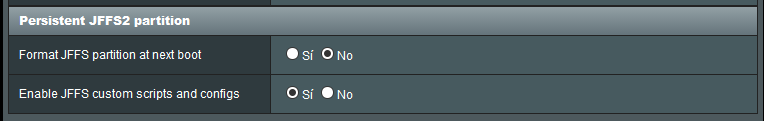
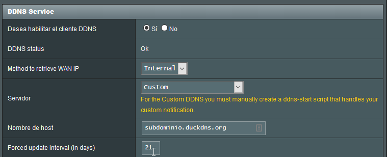

# Dinamyc DNS

Según la wikipedia, el DNS dinámico "_es un servicio que permite la actualización en tiempo real de la  información sobre nombres de dominio situada en un servidor de nombres.  El uso más común que se le da es permitir la asignación de un nombre de  dominio de Internet a un dispositivo con dirección IP variable._"

Habitualmente, el proveedor de internet que tenemos contratado no nos ofrece una dirección ip pública fija. Esto quiere decir, que la dirección ip de acceso desde el exterior a nuestra red es variable, y aunque es habitual que esta no varíe en un largo periodo de tiempo, una alternativa es el uso de algún servicio de DNS dinámico.

## Servicios DNS+

Hay una larga lista de servicios, hasta hace poco he estado utilizando **[no-ip](https://www.noip.com/)**, el cual tiene un servicio gratuito de hasta tres nombres de dominio. El inconveniente que tiene es que hay que verificar cada dominio una vez al mes. Por este motivo he comenzado a utilizar [Duck DNS](https://www.duckdns.org/), un servicio gratuito que una vez lo hayamos configurado no tenemos que realizar ninguna acción.

La configuración de DuckDNS en el firmware Merlin de Asus no es tan simple como si que lo es el servicio **no-ip**, es necesario realizar varios pasos que veremos a continuación para tenerlo configurado correctamente.

* Habilitar scripts personalizados, esta opción se encuentra en Administración > Sistema > Enable JFFS custom scripts and configs.



* Conectarnos vía ssh (debemos tener habilitada esta opción en el router) y en la ruta `/jffs/scripts` crear un fichero llamado **ddns-start**. Este fichero tendrá el siguiente contenido:

```bash
#!/bin/sh

# register a subdomain at https://www.duckdns.org/ to get your token
SUBDOMAIN="subdominio"  #Cambiar por el dominio elegido sin "duckdns.org"
TOKEN="token_duckdns.org" #Cambiar por el token que nos otorga duckdns

# no modification below needed
curl --silent "https://www.duckdns.org/update?domains=$SUBDOMAIN&token=$TOKEN&ip=$1" >/dev/null 2>&1
if [ $? -eq 0 ];
then
    /sbin/ddns_custom_updated 1
else
    /sbin/ddns_custom_updated 0
fi
```

* Cambiar los permisos del fichero para que este se pueda ejecutar

```bash
chmod +x /jffs/scripts/ddns-start
```

* Establecer los parámetros adecuados en la pestaña **DDNS** del menú **WAN**. Aquí podemos ver una captura de ejemplo:



* En la parte inferior tendremos un botón para **aplicar cambios**. Con esto ya habríamos configurado duckdns como nuestro servicio de DNS dinámico.

## Información adicional

En la red disponemos de diversos scripts para utilizar como **ddns-start**. Dos de los scripts que he probado y funcionan correctamente son los siguientes:

1. [Wiki Asuswrt-Merlin](https://github.com/RMerl/asuswrt-merlin/wiki/DDNS-Sample-Scripts#duck-dns) - Es el que utilizo puesto que es el que se encuentra en la wiki oficial.
2. [Kevinxw](https://gist.github.com/kevinxw/f7a5d5402887ca1b5b2c399c60e0921f)
