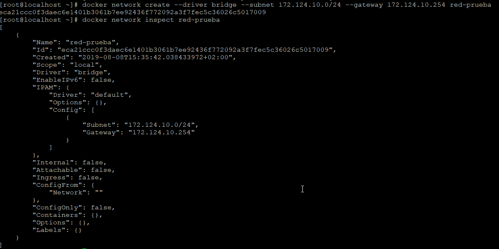
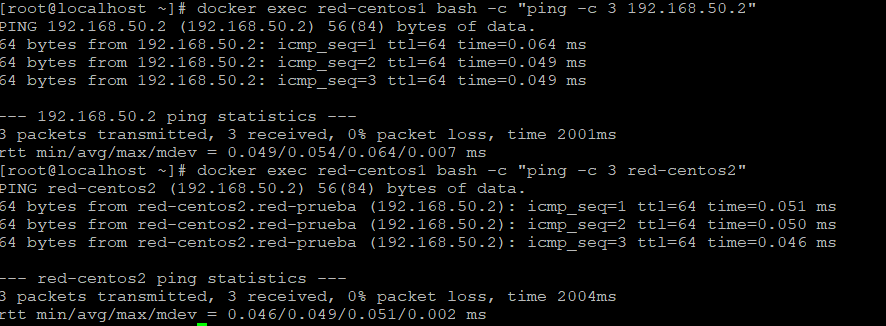

## ¿Qué es Docker?

Es una herramienta que permite desplegar aplicaciones en contenedores de forma rápida y portable. Los términos que más escucharemos cuando hablamos de Docker serán "**contenedores**" e "**imágenes**".

Docker se encuentra disponible para las principales plataformas, como Windows, Linux o MacOS. La máquina que aloja el servicio "**Docker**" se denomina **Docker Host**. Dentro de Docker podemos destacar tres conceptos.

- **Docker Daemon:** representa el servidor de Docker.
- **Rest API:** utilizado para la comunicación bidireccional entre cliente y servidor.
- **Docker CLI (Command Line Interface):** representa el cliente de Docker.

\*_A pesar de que se haya mencionado la línea de comandos como cliente Docker, también existe entorno gráfico para interactuar con el servidor Docker._

Cuando interactuamos con contenedores o imágenes, lo hacemos a través del cliente de Docker, con lo cual nos interesa saber que es lo que podemos gestionar.

- [Imágenes](#que-es-una-imagen)

- [Contenedores](#contenedores)

- [Volúmenes](#volumenes)

- [Redes](#redes)

- [Docker-Compose](#docker-compose)

- [Seguridad](#seguridad)

- [Otros conceptos](#otros-conceptos)

- [Comandos](#comandos)
* [Fuentes](#fuentes)

## ¿Qué es una imagen?

Una imagen en Docker es una especie de instantánea de un contenedor. Para entenderlo de una forma más sencilla, desglosaremos una imagen en diferentes capas.

- **Primera capa (FROM):** se define el sistema operativo (Alpine, CentOS, Ubuntu), de aquí partirá el tamaño mínimo de nuestra imagen.
- **Segunda capa (RUN):** se ejecutan diferentes comandos, habitualmente para la instalación de paquetes necesarios para nuestra aplicación.
- **Tercera capa (CMD):** es la parte que mantendrá en ejecución el contenedor.

Estas capas se definen en el fichero **Dockerfile **y son de sólo lectura (RO - Read Only). Aquí podemos ver un ejemplo de un **Dockerfile**.

```dockerfile
FROM centos:7

RUN yum -y install httpd

CMD ["apachectl","-DFOREGROUND"]
```

El parámetro **CMD** es el que mantiene "**vivo**" el contenedor, en el ejemplo anterior es necesario utilizar como parámetro `-DFOREGROUND` del comando `apachectl` para que el contenedor se mantenga en ejecución. 

!!!    note
    Únicamente podemos encontrar una instrucción **CMD** en un **Dockerfile**, en caso de que     haya más de una, sólo se tendrá en cuenta la última

Podemos definir la instrucción **CMD** de tres modos diferentes:

<ol><li><b>Execform</b>, es la forma más adecuada.</li>

```dockerfile
CMD ["ejecutable","parámetro1","parámetro2"]

#Ruta completa al ejecutable.
CMD ["/bin/echo","Hola mundo"]

#Bash como ejecutable, pasando el parámetro "-c" podemos ejecutar comandos como si estuviesemos en la terminal.
CMD ["/bin/bash","-c", "echo Hola mundo"]
```

<li>Como parámetros que acompañan a la instrucción <b>ENTRYPOINT</b>.</li>

```dockerfile
CMD ["parámetro1","parámetro2"]
```

<li>En formato <b>shell</b>, por debajo ejecuta <code>/bin/sh -c</code>.</li></ol>

```dockerfile
CMD comando parámetro1 parámetro2
```

La diferencia fundamental entre **CMD** y **ENTRYPOINT** se basa en que con el primero de ellos, cuando ejecutamos `docker run` con un comando específico, este comando sobrescribirá el comando definido en el fichero **Dockerfile**.

- **CMD** será el que utilizaremos habitualmente porque nos permite pasar parámetros cuando iniciemos el contenedor.

- **ENTRYPOINT** en caso de querer tener un contenedor como ejecutable, sin intención de pasar ningún parámetro adicional.

### Descargando imágenes

Para la descarga de imágenes utilizaremos el comando `docker pull`. Es posible pasar diferentes parámetros, uno de los más habituales es el **tag** o **etiqueta**. Esta etiqueta nos permite elegir entre diferentes versiones del mismo contenedor, una imagen compatible con la arquitectura de nuestro procesador o una versión, de la aplicación empaquetada en la imagen, particular que necesitemos.

**Ejemplo:**

```bash
#Descarga la versión 3.6.5 de mongo
docker pull mongo:3.6.5-jessie
```

En el ejemplo anterior hemos descargado una versión específica indicándole el **tag** después de los dos puntos.

#### ¿Qué es una etiqueta (tag)?

Una **etiqueta** o **tag** identifica la imagen que vamos a descargarnos. Es una forma sencilla de **versionar** las imágenes. Si no establecemos este parámetro, la etiqueta por defecto que utilizará Docker es **latest**. Las etiquetas disponibles por cada imagen se encuentran enumeradas en el propio repositorio, además en la documentación se encuentran instrucciones que facilitan la elección del tag de la imagen.

A continuación se encuentran dos enlaces que explican de forma extendida las etiquetas de las imágenes de Docker y que formas sencillas hay para versionar una imagen.

[The misunderstood Docker tag: latest](https://medium.com/@mccode/the-misunderstood-docker-tag-latest-af3babfd6375)

[Using Semver for Docker Image Tags](https://medium.com/@mccode/using-semantic-versioning-for-docker-image-tags-dfde8be06699)

### Desarrollando imágenes

La forma sencilla para comenzar ha realizar pruebas es crear un directorio de trabajo que utilizaremos para  desarrollar las primeras imágenes. En este directorio es necesario contar con un fichero **Dockerfile** (lo podemos crear ejecutando `touch Dockerfile`), el cual contendrá las capas que hemos visto más arriba. Este fichero es el utilizado por el comando `docker build` para crear las imágenes.

!!!    note
    Podemos llamar al fichero Dockerfile de cualquier otro modo, pero cuando creemos el contenedor (`docker build`) deberemos indicarle con el parámetro `-f` el nombre del fichero.

#### Dockerfile

¿Qué instrucciones nos podemos encontrar dentro de este fichero?

- **COPY**: permite copiar un fichero o directorio del host a la imagen.
- **ADD**: además de lo que nos permite realizar la instrucción <u>COPY</u>, esta nos **permite pasar una URL** para que descargue el contenido en la ruta que indiquemos dentro de la imagen.
- **ENV**: se utiliza para añadir variables de entorno. La variable se establece **sin el signo =**, la variable y el valor se define con un espacio entre ambos. Ejemplo:

```dockerfile
ENV nombre juan
```

- **WORKDIR**: define el directorio de trabajo dentro del contenedor. Si no definimos este parámetro, por defecto nos encontramos en el directorio raíz **/**.
- **EXPOSE**: permite exponer puertos. Realmente esta instrucción no realizar ninguna exposición, simplemente informa a la persona que va a utilizar la imagen para crear el contenedor que puertos debe configurar. Estos puertos se expondrán utilizando la opción **-p** del comando `docker run`.
- **LABEL**: hace referencia a una etiqueta, que se utiliza habitualmente para añadir metadatos (información sobre la imagen como versión, creador, etc.).
- **USER**: identifica al usuario que ejecuta las instrucciones definidas en el fichero Dockerfile (las instrucciones que se establezcan a partir de la instrucción **user**). Por defecto el usuario que ejecuta las instrucciones es el usuario **root**.
- **VOLUME**: permite que los datos que se encuentran en estos "volúmenes" sean persistentes, ya que después de eliminar el contenedor asociado a este volumen los datos no se perderán. 
- **CMD**: se entiende como la instrucción que mantiene vivo el contenedor.

A continuación veremos un **Dockerfile** con todas las instrucciones vistas hasta el momento:

```dockerfile
FROM nginx

LABEL version=1.0

RUN useradd prueba

USER prueba

WORKDIR /usr/share/nginx/html

COPY web /usr/share/nginx/html

ENV variable1 tzinm

EXPOSE 90

VOLUME  /var/log/nginx

CMD nginx -g 'daemon off;'
```

Las instrucciones que definimos dentro de este fichero deben ser lo más estrictas posibles para evitar errores, por ello es importante tener en cuenta lo siguiente:

- Un servicio por contenedor.
- Utilizar la capa **Labels** para añadir metadatos.
- Agrupar los argumentos, evitando crear una capa por cada argumento.

=== "Forma correcta"
    ```dockerfile
    RUN \
      python3 -m pip install telegram --upgrade && \
      python3 -m pip install python-telegram-bot --upgrade && \
      chown root:root AddToQbitTorrentFolder.py && \
      chmod 644 AddToQbitTorrentFolder.py
    ```

=== "Forma incorrecta"
    ```dockerfile
    RUN python3 -m pip install telegram --upgrade
    RUN python3 -m pip install python-telegram-bot --upgrade
    RUN chown root:root AddToQbitTorrentFolder.py
    RUN chmod 644 AddToQbitTorrentFolder.py
    ```

- Evitar la instalación de paquetes innecesarios, de ese modo crearemos imágenes más ligeras.

Además del fichero **Dockerfile** hay otro fichero importante llamado **.dockerignore**. El funcionamiento de este es similar al fichero **.gitignore**, es un fichero oculto en el que definimos que contenido del directorio no queremos que sea tenido en cuenta.

#### Docker Build

Una vez que tenemos nuestro **Dockerfile** terminado debemos ejecutar el comando `docker build` para crear nuestra imagen.

```bash
docker build -t tzinm/test .
```

En el comando ejecutado se ha denominado a la imagen **tzinm/test**, al no haber especificado ningún tag será el tag **latest** el que se haya establecido. Otro dato importante es el **punto** del final, que hace referencia al [contexto](https://github.com/docker/docker.github.io/issues/5606#issuecomment-354004184), es decir el directorio en el cual Docker buscará los ficheros necesarios para crear la imagen.

#### Multi-Stage Builds

Esta nueva funcionalidad que nos ofrece Docker se encuentra disponible a partir de la versión 17.05. Es una utilidad interesante ya que nos permite crear

En ocasiones, algunas imágenes necesitan cierto contenido que es generado mediante la compilación o ejecución de una serie de instrucciones que hace que el peso de una imagen crezca y su rendimiento no esté lo más optimizado posible. 

Es aquí cuando esta herramienta (**multi-stage builds**) es útil, ya que nos permite en una primera instancia crear una imagen "al vuelo" en la que generaremos esos ficheros mediante las instrucciones que necesitemos. Después esos ficheros serán enviados (veremos luego en un ejemplo como se realiza esto) a la segunda imagen, exclusivamente esos ficheros, desprendiéndonos de la primera imagen y todo lo que ello conlleva.

Recordamos que para hacer un uso adecuado de Docker es necesario optimizar al máximo las imágenes, es la base de las buenas prácticas.

A la hora de crear el fichero **Dockerfile** es muy similar al que utilizamos construyendo una única imagen, salvo que en esta ocasión nos encontramos con la construcción de dos imágenes - por lo tanto dos **FROM**- y en la segunda imagen añadimos una capa - **COPY**- con el flag **--from=primar-imagen** que se encargará de pasar el contenido generado en la primera imagen (**primer FROM**). Se puede ver un poco más claro en el siguiente ejemplo.

```dockerfile
FROM centos as test

RUN fallocate -l 10M /tmp/file1 && \
    fallocate -l 40M /tmp/file2

FROM alpine

COPY --from=test /tmp/file1 /tmp/test1
```

#### Dangling images

Este concepto hace referencia a imágenes huérfanas, que no son más que aquellas imágenes que se encuentran sin _referenciar_.

¿Cuando sucede esto?

Cuando una imagen es construida utilizando el mismo **nombre** y **tag** que otra creada anteriormente. La nueva imagen creada será válida, en cambio las imágenes anteriores que existiesen no serán válidas y pasarán a tener como nombre y tag el valor **\<none\>**.

A pesar de que estas imágenes no son válidas, seguirán estando en nuestro sistema y ocupando espacio, por ello es recomendable eliminarlas. El modo más rápido de eliminar todas estas imágenes es mediante el siguiente comando:

```bash
docker rmi $(docker images -f "dangling=true" -q)
```

En el comando anterior hemos utilizado el flag **-f**, que permite el filtrado de las imágenes siguiendo una serie de [patrones](https://github.com/moby/moby/blob/10c0af083544460a2ddc2218f37dc24a077f7d90/docs/reference/commandline/images.md#filtering).

## Contenedores

Un contenedor se entiende como una capa adicional que mantiene en ejecución las capas que se han definido en el fichero Dockerfile, por este motivo es posible crear tantos contenedores como se deseen a partir de la misma imagen. A diferencia del resto de capas, esta capa es de lectura y escritura (**rw**), por lo tanto nos permite realizar modificaciones sobre las capas anteriores cuando el contenedor se encuentra en ejecución. 

Todas estas modificaciones son temporales puesto que no sobrescriben el fichero Dockerfile, por lo tanto una vez que eliminemos el contenedor esas modificaciones se perderán (algunas modificaciones pueden ser persistentes mediante el uso de volúmenes que veremos más adelante).

**¿Qué nos encontramos dentro de un contenedor?**

- Imagen
- Volúmenes (se utilizan para mantener persistente cierto contenido)
- Redes (útil para comunicar contenedores entre sí)

### Contenedor VS Máquina Virtual

El contenedor es un proceso aislado más del sistema, por lo tanto compartirá el mismo hardware que esté utilizando el sistema operativo anfitrión, es decir, no necesitamos asignarle recursos específicamente (aunque es posible limitar los recursos utilizados por un contenedor).

En cambio, cuando creamos una máquina virtual debemos asignarle una serie de recursos, como pueden ser el número de nucleos, la memoria ram o el espacio en disco duro. En este caso obtenemos una máquina completa dentro del propio sistema anfitrión.

La principal diferencia que nos podemos encontrar es la ligereza, un contenedor está destinado a ser muchísimo más ligero que una máquina virtual, habitualmente un contenedor se utiliza para ejecutar una única aplicación concreta.

### Docker run

Este comando se utiliza para iniciar los contenedores. Aunque parece evidente, no puede haber dos contenedores con el mismo nombre, aunque uno de ellos se encuentre parado.

```bash
docker run -d jenkins -p 80:8080
```

* **-d**: permite correr un contenedor en segundo plano.

* **jenkins**: es el nombre de la imagen utilizada.

* **-p**: permite mapear los puertos. El puerto que se encuentra en el lado izquierdo es el que utilizará el sistema anfitrión, el puerto de la derecha es el interno del contenedor.

* **-e:** asignación de variables de entorno.

En algunas ocasiones si no definimos la capa **CMD** es posible que el contenedor se muera. Si queremos evitar que esto sucede podemos utilizar los parámetros **-i** y **-t** para interactuar con el contenedor.

### Limitando recursos

Por defecto Docker utiliza los recursos de la máquina anfitriona sin límite alguno, a pesar de ello los contenedores consumen muy pocos recursos. Podemos limitar tanto el uso de **CPU** como de **RAM**.

```bash
#Limitando la memoria RAM
docker run -d --memory "100mb" --name recursos-limitados centos 
```

Cuando se muestran las estadísticas con el comando `docker stats` ya no mostrará la RAM limite de nuestra máquina, sino que los que hayamos establecido,  en este caso serán 100MB. Podemos pasar la limitación en **bytes** (b), **kilobytes** (k), **megabytes** (m) o **gigabytes** (g).

```bash
#Limitando el número de cores de la CPU
docker run -d --cpuset-cpus 0-3 --name reclimited2 centos
```

Los núcleos (o cores) se pueden definir mediante un rango (como hemos hecho en el ejemplo anterior) o numerándolos y como separación una coma.

- **0-2** --> utilizaríamos los núcleos 0, 1 y 2.
- **0,2** --> utilizaríamos los núcleos 0 y 2.

### Políticas de reinicio

Establecemos que sucede cuando un contenedor se "apaga" de forma inesperada. Disponemos de las siguientes opciones:

- **No** (es la política por defecto): el contenedor no se reiniciará automáticamente. Si hacemos una prueba deteniendo cualquier contenedor que tengamos en funcionamiento, veremos que este se detiene y ejecutando el comando `docker ps` no aparece. 
- **Always**: con esta opción el contenedor siempre se reiniciará.
- **Unless-stopped:** se reiniciará siempre, salvo que sea detenido manualmente.
- **On-failure**: se reiniciará en caso de que el contenedor se haya detenido por algún fallo.

La política de reinicios se establece ejecutando el parámetro **--restart**.

```bash
docker run --restart unless-stopped 
```

## Volúmenes

Como ya sabemos, si eliminamos un contenedor todos sus datos se eliminarán con él. Para evitar esto tenemos los volúmenes que nos permiten hacer persistentes algunos datos de nuestros contenedores. Estos datos se almacenan en un directorio de la máquina anfitriona.

Docker cuenta con **tres tipos** de volúmenes.

#### Volúmenes Host

En este tipo de volúmenes definimos el directorio donde queremos que se almacene la información que debe ser persistente. Es el tipo de volúmenes que más utilizaremos:

```bash
docker run -v /midirectorio:/directorio-docker
```

#### Volúmenes Anonymous

Seguimos haciendo persistentes los datos, pero en este caso no definimos donde queremos que se almacene la información, sino que Docker genera un directorio aleatorio. 

```bash
docker run -v /directorio-docker
```

Estos directorios se encuentran en una ruta específica bajo el directorio "**raíz**" del servicio Docker. Para conocer dicho directorio es necesario ejecutar la siguiente instrucción:

```bash
docker info | grep -i root
```

Entre los diferentes directorio bajo el directorio raíz de Docker, tenemos un directorio denominado volúmenes, que es el directorio donde se almacenaran estos directorios llamados **anonymous**.

Los directorios **anonymous** también aparecen cuando en un fichero Dockerfile definimos la capa **VOLUME** pero a la hora de ejecutar el contenedor no definimos ningún volumen.

Esta forma de crear volúmenes no es aconsejable por varios motivos.

1. El nombre que otorga al directorio es aleatorio (habitualmente conformado por números), por lo tanto no será sencillo saber que volumen se encuentra asociado a cada contenedor.
2. A la hora de eliminar el contenedor si pasamos la opción **-v** eliminaremos también el volumen asociado a este contenedor.

#### Volúmenes Nombrados

Es una mezcla de los dos anteriores. El volumen se almacena en el mismo lugar que los volúmenes anonymous, pero en este caso somos nosotros quienes elegimos un nombre para estos volúmenes en vez de ser un nombre aleatorio.

Los siguientes comandos se utilizan para la gestión de volúmenes:

<ol><li>Creando un volumen</li>

```bash
docker volume create nombre_del_volumen
```

<li>Listar los volúmenes</li>

```bash
docker volume ls
```

<li>Eliminar un volumen</li>

```bash
docker volume rm nombre_del_volumen
```

<li>Utilizar un volumen nombrado</li>

```bash
docker run -v nombre_del_volumen:/dockercontainer
```

</ol>A diferencia de los volúmenes host, donde debemos indicar la ruta completa del directorio, solo es necesario indicar el nombre del volumen que hayamos creado.

### Dangling Volumes

Este concepto que hemos visto con los contenedores también existe con los volúmenes. Estos aparecen cuando hemos eliminado un contenedor y el volumen asociado a este (volumen anonymous) no se ha eliminado.

Para eliminar estos volúmenes podemos hacerlo con la siguiente línea de terminal:

```bash
docker volume ls -f "dangling=true" -q | xargs docker volume rm
```

- **-f / --filtering**: flag utilizado para filtrar los volúmenes.
- **dangling**: es un filtro booleano que únicamente permite **true** o **false**.
- **-q **(quiet): imprime el ID que identifica a cada volumen.

Con [xargs](https://www.patapalo.net/blog/view/7/ejemplos-de-xargs-en-sistemas-linux-unix) pasamos el resultado a un segundo comando, de ese modo conseguimos eliminar con una única línea todos los volúmenes.

!!!    note
    Los volúmenes se pueden compartir entre varios contenedores, simplemente es indicar el volumen en el parámetro correspondiente cuando creemos los contenedores. Puede ser útil cuando necesitamos que dos contenedores accedan a la información que se encuentra en un directorio de nuestra máquina.

## Redes

Cuando levantamos por primera vez el servicio **Docker** se crea una interfaz virtual llamada **docker0** a la cual se le asigna una dirección ip en una subred diferente a la de nuestra red local. Cuando creamos un contenedor nuevo sin pasarle el parámetro referente a la **red**, este le asigna una dirección ip correspondiente al rango que nos proporciona la interfaz virtual **docker0**.

Algunos de los comandos referentes a la red de Docker:

<ol><li>Ver la redes disponibles</li>

```bash
docker network ls
```

<li>Obtener información sobre una red</li>

```bash
docker network inspect nombre_de_red
```

</ol>!!! note
    Los contenedores que se encuentran en la misma red pueden hacerse ping entre ellos.

### Creación de redes

Cuando creamos una red nueva, esta utilizará los drivers **bridge** (esto se puede cambiar pasando el parámetro `--driver string` cuando creamos la nueva red). El comando para la creación de nuevas redes es el siguiente:

```bash
docker network create nombre_de_red
```

Docker nos permite especificar ciertas configuraciones a la hora de crear la red como puede ser la dirección de red o la puerta de enlace. Para ver que opciones tenemos podemos ejecutar `docker network create --help`.

```bash
docker network create --driver bridge --subnet 172.16.16.0/24 --gateway 172.16.16.254 red-prueba
```

 

También existe la posibilidad de establecer una dirección ip específica a un contenedor, para ello se utiliza el flag `--ip`.

```bash
docker run --network nombre_red --ip 192.168.50.2 -dti --name nombre_contenedor ubuntu
```

### Conectando un contenedor a una red diferente

Sabemos que Docker asigna como red por defecto **bridge**, por lo que si queremos elegir otra red deberemos hacerlo manualmente. La instrucción necesaria para elegir una red diferente a la red por defecto es la siguiente:

```bash
docker run --network nombre_de_red -dti --name prueba-red ubuntu
```

!!!    note
    Podemos ejecutar `docker inspecto prueba-red` para ver las propiedades del contenedor, en las que aparecerá la sección NetworkSetting y se podrá ver la red asignada a este contenedor.

### Conectar contenedores a la misma red

En la red por defecto de Docker (**red bridge**) no podemos reconocer a los contenedores por su **hostname**. En cambio, cuando creamos una red (aunque utilice el driver bridge) es posible la comunicación entre contenedores a través de su hostname, esto se debe a que son redes definidas como "**user define network**".

Para realizar una prueba de comunicación entre dos contenedores podemos utilizar el comando `ping`. Podemos hacer la prueba mediante la dirección ip o mediante el nombre del contenedor.

```bash
#Dirección ip
docker exec nombre_contenedor bash -c "ping -c 3 ip_contenedor2"

#Hostname
docker exec nombre_contenedor bash -c "ping -c 3 nombre_contenedor2"
```



### Contenedores en más de una red

Los contenedores ya existentes pueden tener configurado más de una red diferente.

```bash
docker network connect nombre_red nombre_contenedor
```

El comando `docker inspect` nos permite inspeccionar un contenedor, lo cual permite verificar las diferentes redes configuradas en dicho contenedor, de ese modo podríamos verificar si se ha añadido la nueva red.

Al igual que se puede configurar varias redes en un contenedor, también podemos eliminar varias redes de los contenedores. 

```bash
docker network disconnect nombre_red nombre_contenedor
```

### Eliminar redes

Las redes creadas por un usuario se pueden eliminar, para ello es necesario que ningún contenedor se encuentre asociado a dicha red.

```bash
docker network rm nombre_red
```

### Tipos de drivers de red

**Bridge**

En Docker es el driver de red por defecto, sino se específica uno diferente es el driver utilizado por defecto a la hora de crear nuevas redes. 

**Host**

Este tipo de driver de red elimina el aislamiento entre el contenedor y la máquina anfitriona, por lo tanto utiliza la red que utiliza la máquina anfitriona. Es decir, estos contenedores podrán recibir una dirección ip de forma dinámica por parte del servidor DHCP que tengamos configurado en nuestra red local.

**Overlay**

Permite la comunicación entre diferentes servidores Docker (docker daemons), esto permite que diferentes servicios puedan comunicarse entre si.

**Macvlan**

Permite asignar una dirección MAC a un contenedor, lo cual simula disponer de una tarjeta de red en dicho contenedor.

**None**

Este tipo de driver permite deshabilitar la red en los contenedores. 

## Docker Compose

Es una herramienta que nos ayuda a orquestar contenedores en Docker, gestionar los diferentes contenedores de los que depende una aplicación. Existen aplicaciones que para su correcto funcionamiento dependen de varios servicios, para seguir con la simplicidad de "**un servicio = un contenedor**", Docker Compose nos permitirá administrar los diferentes contenedores de forma grupal. 

Docker Compose trabaja con ficheros de tipo **yaml**, en los que se definen los contenedores, volúmenes, redes, etc. Después de completar el fichero, `docker-compose` como comando se encarga de la lectura del fichero y lanzar todos los contenedores definidos en dichero fichero.

Durante la instalación de Docker-CE esta herramienta no se instala, por lo que será necesaria la instalación de forma independiente. En la [documentación](https://docs.docker.com/compose/install/) oficial se encuentran diferentes guías para la instalación en los diferentes Sistemas Operativos.

En la máquina actual, en la que estamos trabajando bajo Linux, la instalación se haría del siguiente modo:

<ol><li>Descargamos Docker-Compose.</li>

```bash
sudo curl -L "https://github.com/docker/compose/releases/download/1.24.1/docker-compose-$(uname -s)-$(uname -m)" -o /usr/local/bin/docker-compose
```

<li>Aplicar permisos de ejecución al ejecutable que hemos descargado.</li>

```bash
sudo chmod +x /usr/local/bin/docker-compose
```

</ol>### Comenzando con Docker Compose

El nombre del fichero que debemos utilizar es **docker-compose.yml**, donde definiremos los diferentes contenedores.

Este fichero cuenta con cuatro grandes partes:

<ol><li><b>Version</b> (obligatorio): para saber que número de versión (Docker-Compose) debemos establecer, buscamos en la documentación cual es la última versión, suele ser la que se recomienda utilizar.</li>

<li><b>Services</b> (obligatorio): los servicios hacen referencia a los contenedores. En primera instancia definimos los nombres de cada servicio (podemos elegir el que queramos), y debajo de ellos irán los parámetros que hacen referencia al propio contenedor, como el nombre del contenedor, la imagen a la que hace referencia, puertos, variables de entorno, etc.</li>

<li><b>Volumes</b> (opcional):

<ul><li><b>Volúmenes nombrados</b>: funcionan del mismo modo que ejecutando <code>docker run</code>. Lo que hacemos es definir en primer lugar el volumen que crearíamos con la instrucción <code>docker volume create</code> en "volumes" con el nombre que queramos. A continuación lo definimos dentro del servicio.</li>

```yaml
version: '3'
services:
  web:
    image: nginx
    container_name: nginx-prueba
    volumes:
      - "html:/usr/share/nginx/html"
volumes:
  html:
```

<li><b>Volúmenes host</b>: no necesitamos la parte <b>volumes</b> dentro del fichero <b>docker-compose.yml</b> sino que directamente en el contenedorlo podemos parametrizar.</li></ul>

```yaml
version: '3'
services:
  web:
    image: nginx
    container_name: nginx-prueba
    volumes:
      - "/home/miusuario/html:/usr/share/nginx/html"
```

</li><li><b>Networks</b> (opcional):

<ul><li><b>Red Host</b>: <b><a href="https://stackoverflow.com/questions/47074457/how-to-specify-docker-build-network-host-mode-in-docker-compose-at-the-time/47545276#47545276">es importante establecer la versión 3.4 para que funcione correctamente</a></b>. Para que funcione es necesario añadir <b>build</b>, y además añadir el <a href="https://docs.docker.com/compose/compose-file/#build">contexto</a>, que hace referencia a un directorio que contenga un Dockerfile o una url a un repositorio git. Si establecemos la ruta relativa hace referencia a la ubicación del archivo de composición.</li> 

```yaml
version: '3.4'
services:
  web:
    build:
      context: .
      network: host
    image: nginx
    container_name: nginx-prueba
    ports:
      - "8181:80"
```

<li>Creación de una nueva red con subnet. <b>Aún no se permite establecer gateway</b>.</li></ul>

```yaml
version: '3'
services:
  web:
    image: nginx
    container_name: nginx-prueba
     ports:
      - "8181:80"
    networks:
      red-prueba:
        - ipv4_address: 192.168.50.10
networks:
  red-prueba:
    ipam:
      driver: default
      config:
        - subnet: "192.168.50.0/24"
```

En cuanto a las redes, cuando ejecutamos el comando <code>docker-compose up -d</code> se genera una red específica para <b>docker-compose</b>. Si no definimos una red, la red utilizada será la red por defecto (docker-compose_default). Cuando se crea la red, el nombre que es otorgado "<b>directorioactual_nombredelared</b>". Es posible modificar la parte del nombre que hace referencia al "directorioactual", pasando el parámetro <code>-p</code>.

Por lo tanto si nuestro directorio actual se denomina <b>docker-compose</b> y queremos que el prefijo sea por ejemplo </b>dcprueba</b> ejecutaríamos el siguiente comando:

```bash
#Modificar el nombre de red a "dcprueba_default"

docker-compose -p dcprueba up -d
```

</li></ol>

Por otro lado, tenemos dos partes importantes que se utilizan a la hora de crear contenedores.

- **Variables de entorno:** estas se pueden definir de dos modos.

=== "Fichero docker-compose.yml"
      ```yaml
      environment:
        - "VARIABLES1=docker"
      ```

=== "Fichero con extensión .env."
      ````yaml
      environment:
        - variables.env
      ````

* **Command:**  se utiliza para establecer un CMD al contenedor.

```yaml
commmand: mkdir /bin/bash
```

El comando `docker-compose` se encarga de realizar un proceso similar que el comando `docker run`, pero en este caso los diferentes parámetros se encuentran definidos en un fichero. Por lo tanto, las [políticas de reinicio](#Política de reinicio) o la [limitación de recursos](limitando recursos) también se pueden definir.

* Políticas de reinicio:

```yaml
#Reinicio siempre
restart: always

#Reinicio hasta que lo detengamos de forma manual
restart: unless-stopped

#Únicamente se reinicia el contenedor en caso de que haya habido un fallo
restart: on-failure
```

* Limitar recursos:

```yaml
#Limitar memoria
mem_limit: 20m

#Cpu
cpuset: "0"
```

Otras de las directivas relevantes de este fichero es **depends_on**, la cual hace referencia a las dependencias que tiene se contenedor respecto a los que se incluyan en esta directiva.

```yaml
version: '3'
services:
  web:
    image: nginx
    container_name: nginx-prueba
    depends_on: db
  db:
  image: postgres
  container_name: nginx-database
```

El último paso será conocer como podemos eliminar un contenedor creado con la herramienta Docker-Compose. Para ello debemos ejecutar el siguiente comando, situados en el directorio donde se encuentra el fichero **yaml**.

```bash
docker-compose down
```

El comando anterior sigue el siguiente proceso:

1. Detiene el contenedor.
2. Elimina el contenedor.
3. Elimina la red que ha creado por defecto.

### Docker-compose build

Ya conocemos el comando `docker build`, es el encargado de crear imágenes. El comando [`docker-compose build`](https://stackoverflow.com/a/39988980/12868523) tiene un funcionamiento similar, se encarga de generar una imagen a partir de la definición de **build** en el fichero **yaml**. Esta imagen será utilizada como imagen base en la creación del contenedor.

Para que se construya una imagen, sabemos que necesitamos un fichero **Dockerfile**, en el cual se encuentran las capas para la construcción de una imagen. En la sentencia **build** nos encontramos con dos parámetros importantes.

* **Context:** se indica la ruta donde se encuentra el **Dockerfile** que utilizaremos para crear la imagen. Si se encuentra en el mismo directorio se utilizará el punto (**.**).
* **Dockerfile:** el nombre del fichero si este es diferente al nombre por defecto (Dockerfile).

```yaml
version: '3'
services:
  web:
    container_name: web
    image: web-test
    build:
      context: .
      dockerfile: Dockerfile1
```

_\*Si el nombre que hace referencia al Dockerfile no se ha modificado, podemos obviar estos dos parámetros._

```yaml
version: '3'
services:
  web:
    container_name: web
    image: web-test
    build: .
```

## Seguridad

Este apartado lo he denominado "seguridad" porque creo que es donde mejor encajala gestión de los usuarios en Docker. Para profundizar en el tema de seguridad es conveniente revisar la [documentación oficial](https://docs.docker.com/engine/security/security/).

Simplificando mucho, sabemos que los contenedores de Docker son procesos para el sistema anfitrión, por lo tanto el kernel del sistema es compartido entre todos los contenedores y el propio sistema. Es importante tener en cuenta esto ya que el kernel de Linux es el encargado de gestionar el **uid** y el **gid** de los diferentes usuarios, por lo tanto, estos serán compartidos con los contenedores de Docker.

Cuando ejecutamos un contenedor, si no se especifica un usuario en la creación del propio contenedor o en la imagen base del mismo, el **uid** y **gid** por defecto será **0**. Este **id** corresponde al usuario **root**, el usuario administrador de nuestro sistema.

Una buena práctica para controlar este comportamiento es contar con un usuario específico para Docker, al que se le otorgarán los permisos exclusivamente necesarios para que el contenedor que hayamos creado pueda únicamente realizar la tarea para la que se ha creado.

Después de que hayamos creado el usuario que utilizaremos en los contenedores Docker, podemos obtener los ids que necestiamos (uid y gid) ejecutando el siguiente comando:

```bash
id usuario-docker
```

Para indicar al contenedor que usuario será el que ejecute el **CMD**, se lo indicaremos con el flag `-u`.

```bash
docker run -u="uid:gid"
```

Para verlo de una forma más clara, lo trataremos con un <u>ejemplo</u>.

Imaginemos que queremos montar una biblioteca multimedia al estilo "Netflix" a partir de las películas y series digitales que tenemos en nuestros equipos. Hay diversas herramientas que nos facilitan esto, como por ejemplo **Plex**, que es una de las más conocidas. 

Esta biblioteca podemos ponerla en marcha a través de un contenedor Docker, pero para que funcione correctamente este contenedor necesita acceso a las carpetas donde se encuentra todo nuestro contenido multimedia. Bien, si el usuario del contenedor no es el adecuado el contenedor no será capaz de leer los directorios donde se encuentra todo el contenido multimedia, y por lo tanto no podrá realizar su trabajo y no tendremos nuestra ansiada biblioteca multimedia.

Siguiendo con la premisa de un usuario exclusivo para Docker, este usuario debería tener acceso a los directorios donde se encuentra todo el contenido multimedia y a su vez, ser el usuario que hemos pasado por parámetros al contenedor de Plex.

## Otros conceptos

### Docker Registry

Es un servicio donde se alojan las imágenes que utilizará Docker. A este servicio se realizan peticiones mediante los comandos `docker pull` (descargar imágenes) y `docker push` (subir imágenes).

El registry que utilizamos habitualmente es el propio de Docker, conocido como [Docker Hub](https://hub.docker.com/), del que nos descargamos las imágenes desarrolladas por la comunidad. Existe la posibilidad de mantener un registry local, podemos seguir la [documentación oficial](https://docs.docker.com/registry/.) para tenerlo en funcionamiento.

Los siguientes comandos muestran un ejemplo utilizando un registry local.

```bash
#Renombramos la imagen para que coincida con el nombre del registry, como lo haríamos en docker hub.
docker tag hello-world:lastest localhost:5000/hello-world

#Subimos la imagen.
docker push localhost:5000/hello-world

#Descargar la imagen.
docker pull localhost:5000/hellos-world
```

## Comandos

### Comandos más utilizados

| Comando                    | Descripción                                                                                             |
| -------------------------- | ------------------------------------------------------------------------------------------------------- |
| docker images              | lista las imágenes que se encuentran descargadas                                                        |
| docker build               | construir una imagen a partir de un fichero **Dockerfile**                                              |
| docker history             | listar las capas generadas en una imagen concreta                                                       |
| docker run                 | crear un contenedor a partir de una imagen                                                              |
| docker rm                  | eliminar un contenedor                                                                                  |
| docker rmi                 | eliminar una o más imágenes                                                                             |
| docker ps                  | listar los contenedores                                                                                 |
| docker ps -a               | listar todos los contenedores                                                                           |
| docker rename              | cambiar el nombre de un contenedor (renombrar)                                                          |
| docker stop                | detener un contenedor (se puede utilizar el id o el nombre del contenedor)                              |
| docker start               | iniciar un contenedor (se puede utilizar el id o el nombre del contenedor)                              |
| docker restart             | reiniciar un contenedor (se puede utilizar el id o el nombre del contenedor)                            |
| docker logs                | para mostrar los logs de un contenedor. **Con el parámetro "-f" se actualizan los logs en tiempo real** |
| docker inspect             | muestra información detallada de como ha sido construido un contenedor                                  |
| docker stats               | pasando el contenedor a este comando nos muestra cuantos recursos consume dicho contenedor              |
| docker system df --verbose | muestra información detallada sobre el tamaño de todo el contenido de docker                            |
| docker volume ls           | lista los volúmenes de Docker. Únicamente lista los que se encuentran bajo el directorio root de Docker |
| docker exec                | permite ejecutar comandos dentro de un contenedor que esté activo                                       |
| docker history imagen      | muestra como ha sido creado una imagen                                                                  |
| docker cp                  | copiar archivos entre la máquina anfitrión y el contenedor, y viceversa                                 |
| docker prune               | elimina todos los contenedores que se encuentran parados. Antes de eliminarlos se muestra un **aviso**. |

### Otros comandos

<ol><li><b>Docker build</b></li>

```bash
#Construir una imagen con un nombre de Dockerfile diferente al utilizado por defecto. Para ello se utiliza el parámetro "-f".

docker build -t test -f pruebadockerfile .
```

<li><b>Docker exec</b></li>

```bash
#Entrar en la terminal de un contenedor.

docker exec -ti nombre_del_contenedor bash

#exec: ejecutar
#-t: terminal
#-i: interactivo
#bash: la terminal seleccionada
#Se puede establecer el parámetro "-u" para seleccionar un usuario específico.
```

<li><b>Docker ps</b></li>

```bash
#Eliminar todos los contenedores a través de sus IDs.

docker ps -q | xargs docker rm -f
```

```bash
#Eliminar todos los contenedores con estados "exited".

docker ps -a | grep Exit | cut -d ' ' -f 1 | xargs sudo docker rm
```

<li><b>Docker cp</b></li>

```bash
#Copiar ficheros de mi máquina a un contenedor y viceversa.

docker cp mimaquina.txt test:/home

docker cp test:/home/mimaquina.txt .
```

<li><b>Docker run</b></li>

```bash
#Creación de un contenedor con el parámetro --rm para que se autoelimine una vez que haya salido de la sesión del contenedor.

docker run --rm -ti -name test ubuntu:latest bash
```

<li><b>Docker rmi</b></li>

```bash
#Eliminar imagenes huérfanas
docker rmi $(docker images -f "dangling=true" -q)

#Eliminar imagenes por fecha. Since (imagenes creadas posteriormente a la imagen pasada en el filtro), Before (imagenes creadas anteriormente a la imagen pasada en el filtro).
docker rmi $(docker images -f since="images" -q)
```

<li><b>Docker commit</b></li>

```bash
#Crear una imagen a partir de un contenedor
docker commit nombre-contenedor imagen-nueva
```

<li><b>Docker history</b></li>

```bash
#Visualizar el CMD del contenedor
docker history -h nombre-contenedor
```

</ol>

## Fuentes

### Docker bases

[Docker, de principiante a experto](https://www.udemy.com/course/docker-de-principiante-a-experto/)

[Docker for beginners](https://docker-curriculum.com/)

[Capítulos Docker atareao.es](https://www.atareao.es/tutorial/docker/)

[Docker Tips](https://dockertips.com)

[Docker desde las bases: Comprendiendo imagenes](https://code.tutsplus.com/es/tutorials/docker-from-the-ground-up-understanding-images--cms-28165)

[Docker español GitHub](https://github.com/brunocascio/docker-espanol)

### Docker en profundidad

[Docker CMD vs ENTRYPOINT](https://goinbigdata.com/docker-run-vs-cmd-vs-entrypoint/)

[Understanding how uid and gid work in Docker containers](https://medium.com/@mccode/understanding-how-uid-and-gid-work-in-docker-containers-c37a01d01cf)

[Buenas prácticas construyendo imágenes Docker](https://medium.com/@serrodcal/buenas-pr%C3%A1cticas-construyendo-im%C3%A1genes-docker-8a4f14f7ad1d)

[Eliminar volúmenes huérfanos](https://www.albertcoronado.com/2017/05/15/truco-docker-eliminar-volumnenes-huerfanos/)

[Dopcker Hub Automated Build Tagging](https://stackoverflow.com/a/44796846/12868523)

[Using Semver for Docker Image Tags](https://medium.com/@mccode/using-semantic-versioning-for-docker-image-tags-dfde8be06699)

[Comando para saber los dockers corriendo y sus puertos](https://ugeek.github.io/blog/post/2019-09-23-comando-para-saber-los-dockers-corriendo-y-sus-puertos.html)