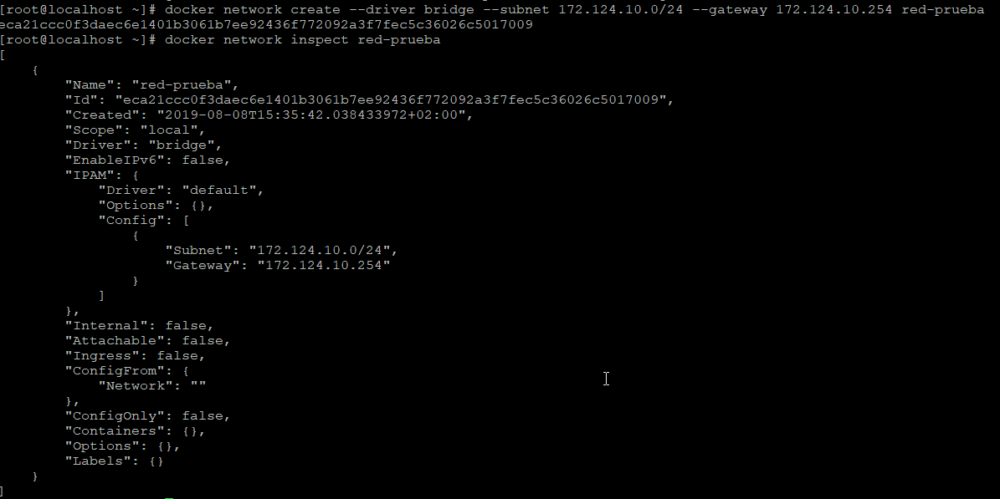

Cuando levantamos por primera vez el servicio **Docker** se crea una interfaz virtual llamada **docker0** a la cual se le asigna una dirección ip en una subred diferente a la de nuestra red local. Cuando creamos un contenedor nuevo sin pasarle el parámetro referente a la **red**, este le asigna una dirección ip correspondiente al rango que nos proporciona la interfaz virtual **docker0**.

Algunos de los comandos referentes a la red de Docker:

<ol><li>Ver la redes disponibles</li>


```bash
docker network ls
```

<li>Obtener información sobre una red</li>

```bash
docker network inspect nombre_de_red
```

</ol>!!! note
    Los contenedores que se encuentran en la misma red pueden hacerse ping entre ellos.

### Creación de redes

Cuando creamos una red nueva, esta utilizará los drivers **bridge** (esto se puede cambiar pasando el parámetro `--driver string` cuando creamos la nueva red). El comando para la creación de nuevas redes es el siguiente:

```bash
docker network create nombre_de_red
```

Docker nos permite especificar ciertas configuraciones a la hora de crear la red como puede ser la dirección de red o la puerta de enlace. Para ver que opciones tenemos podemos ejecutar `docker network create --help`.

```bash
docker network create --driver bridge --subnet 172.16.16.0/24 --gateway 172.16.16.254 red-prueba
```

 

También existe la posibilidad de establecer una dirección ip específica a un contenedor, para ello se utiliza el flag `--ip`.

```bash
docker run --network nombre_red --ip 192.168.50.2 -dti --name nombre_contenedor ubuntu
```

### Conectando un contenedor a una red diferente

Sabemos que Docker asigna como red por defecto **bridge**, por lo que si queremos elegir otra red deberemos hacerlo manualmente. La instrucción necesaria para elegir una red diferente a la red por defecto es la siguiente:

```bash
docker run --network nombre_de_red -dti --name prueba-red ubuntu
```

!!!note
    Podemos ejecutar `docker inspecto prueba-red` para ver las propiedades del contenedor, en las que aparecerá la sección **NetworkSetting** y se podrá ver la red asignada a este contenedor.

### Conectar contenedores a la misma red

En la red por defecto de Docker (**red bridge**) no podemos reconocer a los contenedores por su **hostname**. En cambio, cuando creamos una red (aunque utilice el driver bridge) es posible la comunicación entre contenedores a través de su hostname, esto se debe a que son redes definidas como "**user define network**".

Para realizar una prueba de comunicación entre dos contenedores podemos utilizar el comando `ping`. Podemos hacer la prueba mediante la dirección ip o mediante el nombre del contenedor.

```bash
#Dirección ip
docker exec nombre_contenedor bash -c "ping -c 3 ip_contenedor2"

#Hostname
docker exec nombre_contenedor bash -c "ping -c 3 nombre_contenedor2"
```


### Contenedores en más de una red

Los contenedores ya existentes pueden tener configurado más de una red diferente.

```bash
docker network connect nombre_red nombre_contenedor
```

El comando `docker inspect` nos permite inspeccionar un contenedor, lo cual permite verificar las diferentes redes configuradas en dicho contenedor, de ese modo podríamos verificar si se ha añadido la nueva red.

Al igual que se puede configurar varias redes en un contenedor, también podemos eliminar varias redes de los contenedores. 

```bash
docker network disconnect nombre_red nombre_contenedor
```

### Eliminar redes

Las redes creadas por un usuario se pueden eliminar, para ello es necesario que ningún contenedor se encuentre asociado a dicha red.

```bash
docker network rm nombre_red
```

### Tipos de drivers de red

#### Bridge

En Docker es el driver de red por defecto, sino se específica uno diferente es el driver utilizado por defecto a la hora de crear nuevas redes. 

#### Host

Este tipo de driver de red elimina el aislamiento entre el contenedor y la máquina anfitriona, por lo tanto utiliza la red que utiliza la máquina anfitriona. Es decir, estos contenedores podrán recibir una dirección ip de forma dinámica por parte del servidor DHCP que tengamos configurado en nuestra red local.

#### Overlay

Permite la comunicación entre diferentes servidores Docker (docker daemons), esto permite que diferentes servicios puedan comunicarse entre si.

#### Macvlan

Permite asignar una dirección MAC a un contenedor, lo cual simula disponer de una tarjeta de red en dicho contenedor.

#### None

Este tipo de driver permite deshabilitar la red en los contenedores. 