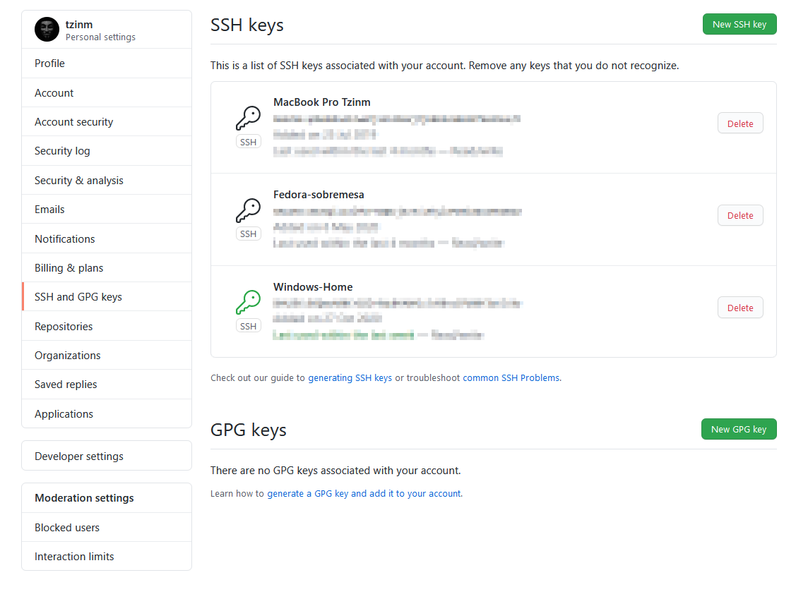

Son plataformas que se encargan de alojar el código de los diferentes proyectos que diferentes desarrolladores deciden publicar. La decisión habitualmente puede deberse a varios motivos.

* Colaboración. Es una herramienta magnífica para que diferentes desarrolladores trabajen sobre un mismo proyecto.
* Permitir que otras personas ajenas al proyecto lo mejoren.
* Crear nuevo software a partir de dicho proyecto.
* Favorecer el Software de código abierto.

Hay varias plataformas disponibles para ello, como por ejemplo **GitHub**, que será la plataforma sobre la que se basarán todas las explicaciones que hagan referencia a **Git** en repositorios remotos, **GitLab** o **Bitbucket**.

### Clonación de repositorios

La clonación nos permite descargar un proyecto a nuestro equipo local. Es una forma de poder estudiar el código del proyecto que nos estamos descargando.

````bash
git clone dirección_repositorio
````

Podemos utilizar la dirección del repositorio en formato **ssh** o **https** que copiaremos del repositorio remoto en GitHub.

!!!note
	La descarga de un proyecto incluye todo el historial de commit.

### Conexión SSH con GitHub

* Creación de llaves (pública y privada) ssh

````bash
ssh-keygen -t rsa -b 4096
````

**-t:** type

**-b:** número de bits

* Copiar la **llave pública** creada en el apartado correspondiente de los ajustes de GitHub.



### Conexión con remotos

Cuando queremos conectar nuestro proyecto local con el repositorio en GitHub debemos añadir la conexión remota con este para poder realizar las acciones de envío (**push**) y recepción (**pull**) de código.

Para llevar a cabo la conexión simplemente debemos ejecutar un comando, donde `dirección_remota` será la dirección del repositorio que GitHub nos indique y `nombre_remoto` utilizaremos la palabra **origin**. Si no nos hemos dado cuenta, cuando ejecutamos `git clone` para descargarnos un repositorio remoto, se asocia un remoto que evidentemente apunta a la dirección del repositorio clonado.

```bash
git remote add origin dirección_remota
```

!!!note
	La descarga de un proyecto incluye todo el historial de commit.

Si la dirección del remoto que hemos establecido es incorrecta podemos cambiarla ejecutando el siguiente comando.

````bash
git remote set-url origin dirección_remota
````

### Envío y recepción

Con esto nos referimos al contenido que subimos o nos descargamos a/hacia un repositorio remoto.

#### Subir contenido

* Subimos la rama master

````bash
git push origin master
````

* Subimos todas las ramas del proyecto

````bash
git push origin --all
````

!!!note
	El nombre remoto tal y como hemos visto en el anterior apartado será **origin** ya que es el nombre que hemos asignado a la url que apunta al repositorio remoto.


#### Descargar contenido

* Actualizamos/descargamos la rama master

````bash
git pull origin master
````

* Actualizamos la rama master y reorganizamos commit

```bash
git pull --rebase origin master
```

!!!note
	Al igual que sucede con el comando `git push` **origin** es la referencia a la url del repositorio remoto.

#### Desengranando Git pull

A la hora de descargar contenido del repositorio remoto es habitual utilizar el comando `git pull`. Este comando realmente se compone de otros dos comandos que se ejecutan por detrás.

##### Git fetch

Este es el primer comando que se ejecuta, el cual pregunta al repositorio remoto si tiene novedades y en caso de que así sea las descarga en la rama **origin/master** de nuestro repositorio local.

```bash
git fetch origin
```

##### Git merge

Este comando lo hemos visto en el apartado de las [fusiones](#fusionar ramas) y aquí tiene la misma funcionalidad. Trata de fusionar la rama **origin/master**, que contiene las novedades del repositorio remoto, con la **rama master local** para que esta esté actualizada.

```` bash
git merge origin/master
````

!!!note
	Es necesario recordar que como ya habíamos visto es necesario situarnos en la rama a la que queremos fusionar la rama que introducimos en el comando.

Cuando trabajamos en colaboración con otras personas en un proyecto es importante conocer estos dos comandos ya que habitualmente sustituirán al comando `git pull`. 

En muchas ocasiones el repositorio remoto y el local no estarán sincronizados debido a que el remoto habrá sido actualizado por un algún colaborador. Por lo tanto, antes de realizar `git push` será necesario actualizar nuestro repositorio local para que este se encuentre sincronizado con el repositorio remoto. La mejor forma de llevar el control de estos cambios es ejecutando `git fetch` y `git merge` como sustitutos de `git pull`.

### Fork de un repositorio

Realizar **fork** no es más que realizar una copia de un repositorio. En el momento de la copia ambos repositorios son idénticos, ramas, historial del proyecto, etc. A partir de ese momento cada uno de ellos puede evolucionar por caminos diferentes ya que no están sincronizados de ningún modo. En este punto se puede dar lo siguiente:

* Evolucionar el proyecto de forma independiente, el proyecto original y su fork tienen un historial completamente diferente.
* Mejorar el proyecto manteniendo el historial de ambos sincronizado.

En el primer punto simplemente trabajaremos como si de un nuevo proyecto se tratara, sincronización entre el repositorio remoto de nuestra cuenta de GitHub y nuestro repositorio local. En el segundo punto, el que nos interesa, se trata de mejorar el proyecto original y después incorporar dichas mejoras a través de una solicitud que se denomina **pull request**.

Cuando trabajamos en este tipo de repositorios pasamos a trabajar con dos repositorios remotos.

* **origin**: este remoto ya lo conocemos, es el remoto que apunta a la dirección donde se encuentra nuestro repositorio remoto.
* **upstream**: al igual que *origin*, se utiliza este nombre por convención. En este caso, apunta a la dirección del repositorio original, es decir, al repositorio sobre el que hemos hecho fork.

El proceso para sincronizar el repositorio original y nuestro repositorio local es similar al que hemos visto anteriormente.

* Añadimos el repositorio remoto original.

````bash
git remote add upstream dirección_remota
````

* Comprobamos y descargamos cambios en caso de que haya a local.

````bash
git fetch upstream
````

* Fusionamos los cambios upstream con nuestra rama master local.

````bash
git merge origin/upstream
````
