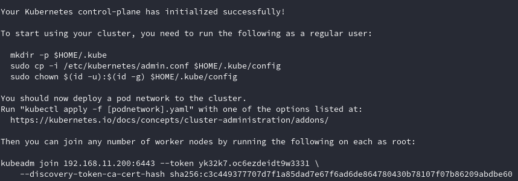

# Desplegando Kubernetes

Actualmente disponemos diferentes formas de desplegar Kubernetes. Basado en la **nube**, siendo este muy sencillo de configurar y mantener, y basado en **máquinas físicas** (bare metal), sistema más complejo de desplegar y mantener.

Este proyecto lo llevaremos a cabo en un clúster con **3 Raspberry Pi**, explicando en este apartado los pasos necesarios para desplegar nuestro clúster de Kubernetes.

Comenzaremos haciendo una breve introducción de las primeras configuraciones que debemos realizar para acceder a nuestras Raspberry Pi. Puesto que este proyecto se centra en Kubernetes, no profundizaremos en los pasos que debemos seguir para tener un SO funcionando en una Raspberry Pi.

El sistema elegido para cada una de nuestras Raspberry Pi ha sido **CentOS 7**, la cual podemos descargar desde [este enlace](http://isoredirect.centos.org/altarch/7/isos/armhfp). Ya que el proyecto que realizamos se basa centra en Kubernetes, no profundizaremos sobre los pasos que debemos seguir para instalar y configurar los SO en la Raspberry Pi.

Una vez que tenemos la imagen que deseamos (la elegida ha sido la minimal) podemos seguir los pasos para preparar la tarjeta SD y las recomendaciones que nos encontramos en la [wiki de CentOS](https://wiki.centos.org/SpecialInterestGroup/AltArch/armhfp).

Partiendo de que ya tenemos las Raspberry Pi funcionando correctamente, vamos a configurar nuestro equipo agregando las llaves y los datos de conexión para facilitar el acceso vía ssh.

Fichero `.ssh/config`

```yaml
Host rpi4
    HostName 192.168.11.200
    User root
    IdentityFile ~/.ssh/rpi4.pub
Host rpi2
    HostName 192.168.11.205
    User root
    IdentityFile ~/.ssh/rpi2.pub
Host rpi2-nfs
    Hostname 192.168.11.220
    User root
    IdentityFile ~/.ssh/rpi2-nfs.pub
```

A continuación nos centraremos con las configuraciones que debemos realizar para preprar nuestro clúster. En primer lugar configurar el fichero `/etc/hosts` de cada una de las placas y añadir todos los nodos que conforman el clúster.

```
192.168.11.200 rpi4.local
192.168.11.205 rpi2.local
192.168.11.206 rpi3-node.local
192.168.11.207 rpi3.local
```

En la distribuciones que cuentan con **SELinux** es necesario establecerlo en el modo **permisivo**. Esto se debe a que los contenedores necesitan acceder al sistema de ficheros del anfitrión.

Establecer SELinux en modo permisivo en la sesión actual.

```bash
setenforce 0
```

De igual modo es neceario modificar el fichero SELinux para que se aplique la configuración de forma permanente.

```bash
sed -i &#39;s/SELINUX=enforcing$/SELINUX=permissive/&#39; /etc/selinux/config
```

Necesitamos abrir una serie de puertos para diferentes finalidades.

| Protocolo | Puerto    | Función                           | Comando                                             |
| --------- | --------- | --------------------------------- | --------------------------------------------------- |
| TCP       | 64443     | Kubernetes API                    | `firewall-cmd --permanent --add-port=6443/tcp`      |
| TCP       | 2379-2380 | API del cliente del servidor etcd | `firewall-cmd --permanent --add-port=2379-2380/tcp` |
| TCP       | 10250     | Kubelet API                       | `firewall-cmd --permanent --add-port=10250/tcp`     |
| TCP       | 10251     | Kube-scheduler                    | `firewall-cmd --permanent --add-port=10251/tcp`     |
| TCP       | 10252     | Kube-controller-manager           | `firewall-cmd --permanent --add-port=10252/tcp`     |

Después de configurar los puertos en el firewall es necesario ejecutar los siguientes comandos:

```bash
#Recargar la configuración del firewall
firewall-cmd --reload

#Añadir el modulo br_netfilter al kernel
modprobe br_netfilter

#Iptables configuration
echo &#39;1&#39; > /proc/sys/net/bridge/bridge-nf-call-iptables

#Deshabilitar swap
swapoff -a
```

Tanto el comando relacionado tanto con iptables como con swap únicamente afectan al sistema en ejecución, por lo que si deseamos que los cambios sean permanentes es necesario realizar varias modificaciones.

- Fichero `/etc/fstab`: comentar (**#**) la línea que hace referencia a swap.

- Fichero `/etc/sysctl.conf`: añadir la línea `net.bridge.bridge-nf-call-iptables=1`.

A continuación procederemos a la instalación de los paquetes necesarios para el funcionamiento del Nodo Master.

!!! note
    En la guía que podemos encontrar en la web de Kubernetes, nos facilitan los datos del repositorio para la descarga de paquetes. Este repositorio [no funciona correctamente](https://github.com/kubernetes/release/issues/520) en armhfp. La alternativa que tenemos es decargarnos los paquetes manualmente desde [este enlace]([Index of /kubernetes/yum/repos/kubernetes-el7-armhfp/Packages/](https://mirrors.aliyun.com/kubernetes/yum/repos/kubernetes-el7-armhfp/Packages/)) e instalarlos con rpm.

Debido a que el repositorio que hemos configurado no funciona correctamente es necesario realizar la instalación de los paquetes y sus dependencias manualmente.

Una vez descargado **kubeadm**, si ejecutamos el comando `rpm -ivh kbueadm.armhfp.rpm` nos aparecerá el siguiente mensaje:

```bash
error: Error de dependencias:
    cri-tools >= 1.13.0 es necesario por kubeadm-1.18.2-0.armhfp
    kubectl >= 1.13.0 es necesario por kubeadm-1.18.2-0.armhfp
    kubelet >= 1.13.0 es necesario por kubeadm-1.18.2-0.armhfp
    kubernetes-cni >= 0.7.5 es necesario por kubeadm-1.18.2-0.armhfp
```

Vamos a descargarnos los paquetes manualmente.

```bash
#cri-tools
curl -O https://mirrors.aliyun.com/kubernetes/yum/repos/kubernetes-el7-armhfp/Packages/7a54305aa8552436821a60337683164a50d34fd76ac558dfd2ef529e6e29395e-cri-tools-1.13.0-0.armhfp.rpm
```

!!! note
    Será necesario seguir el mismo procedimiento con el resto de paquetes.

  Procedemos a instalar los paquetes.

```bash
#Kubeadm
rpm -ivh --ignorearch *.rpm
```

!!! note
    La opción `--ignorearch` es necesaria puesto que los metadatos de los paquetes rpm que hacen referencia a la arquitectura no son correctos. Es posible que nos dé algún error de dependencias, será necesario instalar los paquetes que nos indique.

Continuamos con la puesta en marcha del sistema, iniciando y habilitando los diferentes servicios necesarios para el correcto funcionamiento de kubernetes.

```bash
#Docker
yum install -y docker

systemctl enable docker

systemctl start docker

#Kubelet
systemctl enable kubelet

systemctl start kubelet
```

Si comprobamos el estado de **kubelet** `systemctl status kubeletet`, es posible que aparezca un error relacionado con **cgroup_driver**. Para solucionarlos es necesario añadir en el fichero `/etc/sysconfig/kubelet` *KUBELET_EXTRA_ARGS=--cgroup-driver=systemd*.

El siguiente paso será iniciar **kubeadm** ejecutando el comando `kubeadm init`. Si la ejecución del comando ha sido exitosa veremos la siguiente información.

!!! warning
    Es posible que nos aparezca un error **cgroups_memory missing**. Para solventar este error es necesario añadir **cgroup_enable=memory** y **cgroup_memory=1** en el fichero `/boot/cmdline.txt`.



Siguiendo las indicaciones que podemos ver en la imagen ejecutaremos los comandos que nos indican.

```bash
mkdir -p $HOME/.kube

cp -i /etc/kubernetes/admin.conf $HOME/.kube/config

chown $(id -u):$(id -g) $HOME/.kube/config
```

**Kubectl** es la herramienta de línea de comandos (más adelante se estudiará en profundidad) utilizada para controlar Kubernetes. Uno de los primeros comandos que utilizaremos será para comprobar el estado de los nodos.

```bash
kubectl get nodes
```

El resultado nos mostrará el/los nodos que tenemos en nuestro clúster. En el momento de instalación solo disponíamos del Nodo Master.

```bash
NAME   STATUS     ROLES    AGE     VERSION
rpi4   NotReady   master   6h45m   v1.18.2
```

El Nodo Master se encuentra como **no disponible**, será necesario seleccionar el modo de gestionar la red de Kubernetes de la lista que podemos encontrar [aquí](https://kubernetes.io/docs/concepts/cluster-administration/networking/#how-to-implement-the-kubernetes-networking-model). La elegida es [Weave Net from Weaveworks](https://kubernetes.io/docs/concepts/cluster-administration/networking/#weave-net-from-weaveworks) puesto que es simple de utilizar y su funcionamiento es fiable.

```bash
kubectl apply -f "https://cloud.weave.works/k8s/net?k8s-version=$(kubectl version | base64 | tr -d &#39;\n&#39;)"
```

Para añadir nodos a nuestro clúster será necesario seguir el proceso que hemos seguido hasta este momento. El único comando que no es necesario ejecutar es `kubeadm init`, que es el comando encargado de crear el clúster de Kubernetes.

Al final del proceso será necesario añadir el nuevo nodo al clúster ejecutando el comando que hemos visto en la imagen anterior.

```bash
kubeadm join 192.168.11.200:6443 --token yk32k7.oc6ezdeidt9w3331 --discovery-token-ca-cert-hash sha256:c3c449377707d7f1a85dad7e67f6ad6de864780430b78107f07b86209abdbe60
```

!!! note
      Si no hemos capturado la información que nos mostraba la cli después de crear el clúster, podemos obtener la misma información ejecutando `kubeadm token create --print-join-command`.