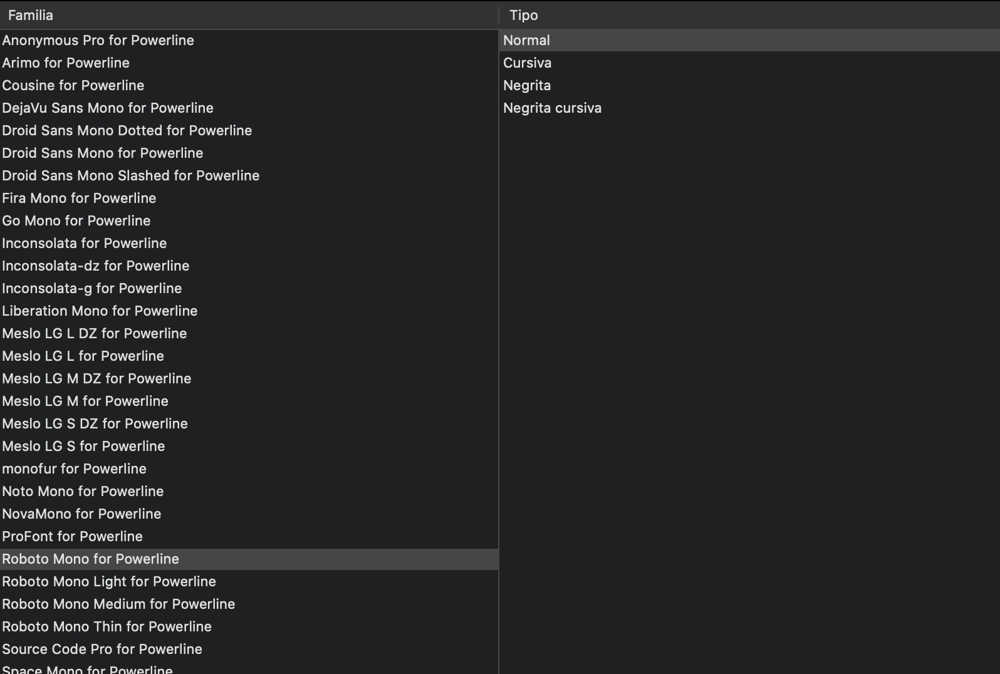
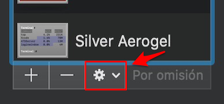
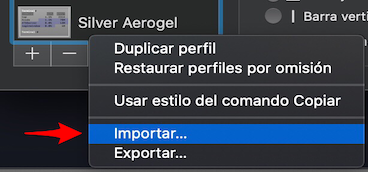

## Personalizando el terminal

Powerline es una utilizar que nos permite personalizar nuestra terminal. 

Las instalación de esta herramienta es sencilla, aunque necesitaremos el gestor de paquetes **pip** proporcionado por **Python**.

* Instalando **python** a través del gestor de paquetes [Homebrew](https://brew.sh/index_es)

```bash
brew install python
```

* Instalando **powerline**

```bash
pip3 install --user powerline-status
```

Para comprobar la ruta donde se ha instalado esta utilidad ejecutaremos el siguiente comando:

```bash
pip3 show powerline-status
```

Aparecerá una serie de información, entre ellas una línea que comienza por **"Location"**, la cual nos informa de la ruta. Es importante tenerla en cuenta ya que será necesario para las siguientes configuraciones.

Lo siguiente que haremos será introducirlo en el fichero **.bash_profile** (es uno de los ficheros utilizados por bash para configurar el etorno del sistema) de nuestro usuario. En caso de que este fichero no se encuentre en nuestro sistema podemos crearlo ejecutando `vim .bash_profile`.

A este archivo le añadiremos lo siguiente:

```bash
#Añadimos python a la variable PATH
export PATH=$PATH:$HOME/Librar/Python/3.7/bin

#Habilitamos powerline
powerline-daemon -q
POWERLINE_BASH_CONTINUATION=1
POWERLINE_BASH_SELECT=1
source $HOME/Library/Python/3.7/lib/python/site-packages/powerline/bindings/bash/powerline.sh
```


### Copiando la configuración

Para una edición posterior de los ficheros de configuración que nos permitirán personalizar powerline al extremo, es necesario copiar el directorio `config_flies` a nuestro $HOME. Para ello ejecutaremos los siguiente comandos:

```bash
#Creamos el directorio en nuestro $HOME
mkdir ~/.config/powerline
#Copiamos los ficheros de configuración
cp -R $HOME//Library/Python/3.7/lib/python/site-packages/powerline/config_files/* ~/.config/powerline
```

El siguiente paso será realizar una modificación en un fichero de configuración que se encuentra en la ruta `~/.config/powerline/config.json`. Debemos modificar el bloque que hace referencia a la **shell**, cambiando el tema a **default_leftonly**.

```json
		"shell": {
			"colorscheme": "default",
			"theme": "default_leftonly",
			"local_themes": {
				"continuation": "continuation",
				"select": "select"
			}
```

!!! tip

​	Después de realizar cambios en los ficheros de configuración es imprescindible ejecutar el comando `powerline-daemon --replace`.	


### Instalando las fuentes

```bash
# Clonación del repositorio
git clone https://github.com/powerline/fonts.git --depth=1
# Instalación de las fuentes
cd fonts
./install.sh
# Eliminamos el repositorio descargado
cd ..
rm -rf fonts
```

Como se puede observar en el script de instalación (**install.sh**), al realizar la instalación en MacOS las fuentes se almacenan en la ruta `$HOME/Library/Fonts`.

Para que la terminal muestre correctamente los iconos, es necesario cambiar la fuente en la configuración del terminal a una de las descargadas compatibles con powerline.




### Powerline-gitstatus

Es un pequeño "plugin" que utilizamos para añadir información sobre git en el prompt. El listado de información que es capaz de mostrar se puede encontrar [aquí](https://github.com/jaspernbrouwer/powerline-gitstatus#glossary). 

Podemos utilizar el gestor de paquetes **pip** para instalarlo.

```bash
pip install --user powerline-gitstatus
```

Una vez que lo hayamos instalado (podemos comprobarlo ejecutando `pip list installed | grep gitstatus`) debemos modificar dos ficheros de configuración.

* **Esquema de colores**: el fichero a modificar se encuentra en la ruta `~/.config/powerline/colorschemes/shell/default.json`. 

```json
{
  "groups": {
    "gitstatus":                 { "fg": "gray8",           "bg": "gray2", "attrs": [] },
    "gitstatus_branch":          { "fg": "gray8",           "bg": "gray2", "attrs": [] },
    "gitstatus_branch_clean":    { "fg": "green",           "bg": "gray2", "attrs": [] },
    "gitstatus_branch_dirty":    { "fg": "gray8",           "bg": "gray2", "attrs": [] },
    "gitstatus_branch_detached": { "fg": "mediumpurple",    "bg": "gray2", "attrs": [] },
    "gitstatus_tag":             { "fg": "darkcyan",        "bg": "gray2", "attrs": [] },
    "gitstatus_behind":          { "fg": "gray10",          "bg": "gray2", "attrs": [] },
    "gitstatus_ahead":           { "fg": "gray10",          "bg": "gray2", "attrs": [] },
    "gitstatus_staged":          { "fg": "green",           "bg": "gray2", "attrs": [] },
    "gitstatus_unmerged":        { "fg": "brightred",       "bg": "gray2", "attrs": [] },
    "gitstatus_changed":         { "fg": "mediumorange",    "bg": "gray2", "attrs": [] },
    "gitstatus_untracked":       { "fg": "brightestorange", "bg": "gray2", "attrs": [] },
    "gitstatus_stashed":         { "fg": "darkblue",        "bg": "gray2", "attrs": [] },
    "gitstatus:divider":         { "fg": "gray8",           "bg": "gray2", "attrs": [] }
  }
}
```

* **Segmento**: el fichero a modificar se encuentra en la ruta `~/.config/powerline/themes/shell/default_leftonly.json`.

```json
{
    "function": "powerline_gitstatus.gitstatus",
    "priority": 40
}
```


!!! Warning

​	La ruta de los ficheros puede variar.


### Temas para el terminal

La terminal por defecto de MacOS permite añadir importar temas. Los temas pueden ser desarrollados por nosotros o descargados desde internet. Para importar un tema debemos abrir el **panel de preferencias** de la terminal.

* Desplegar el menú de configuración.



* Seleccionar la opción Importar:



##### Temas:

* [Iceberg](https://cocopon.github.io/iceberg.vim/)
* [Solarized](https://github.com/altercation/solarized)


### Referencias

* [Documentación Powerline](https://powerline.readthedocs.io/en/latest/index.html)

* [Shell configuration](http://hayne.net/MacDev/Notes/unixFAQ.html#shellStartup)

* [How to install Powerline to pimp you Bash prompt (for Mac)](https://medium.com/@ITZDERR/how-to-install-powerline-to-pimp-your-bash-prompt-for-mac-9b82b03b1c02)